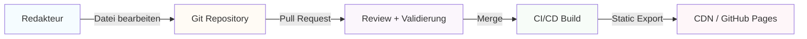
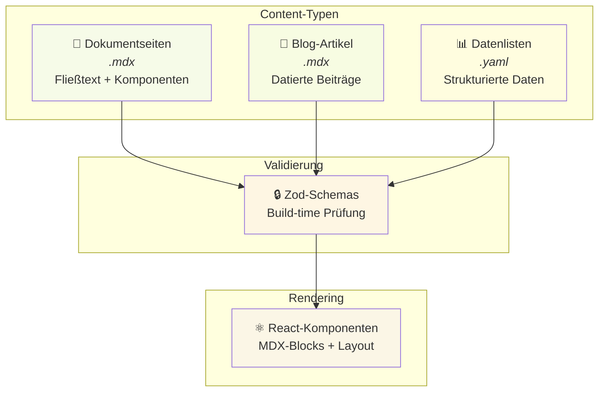
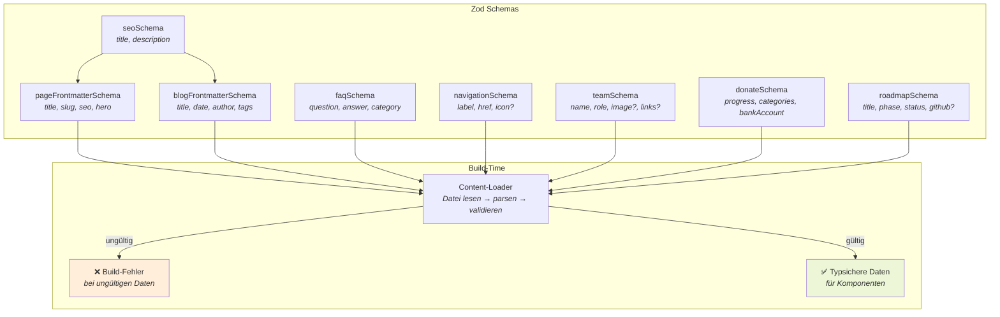
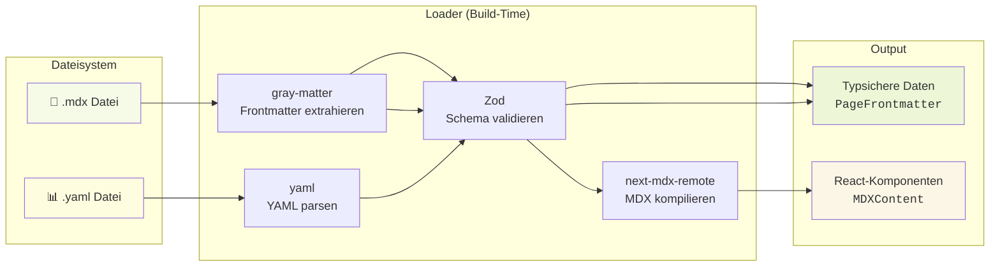
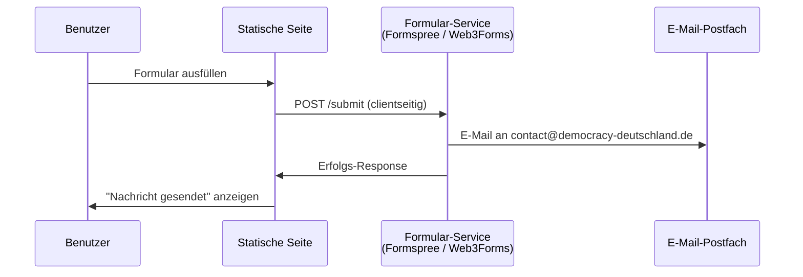
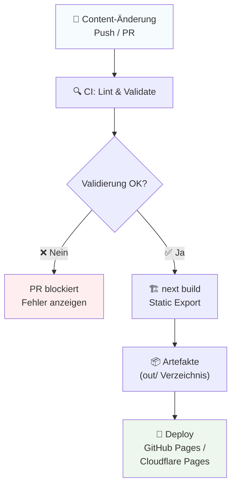
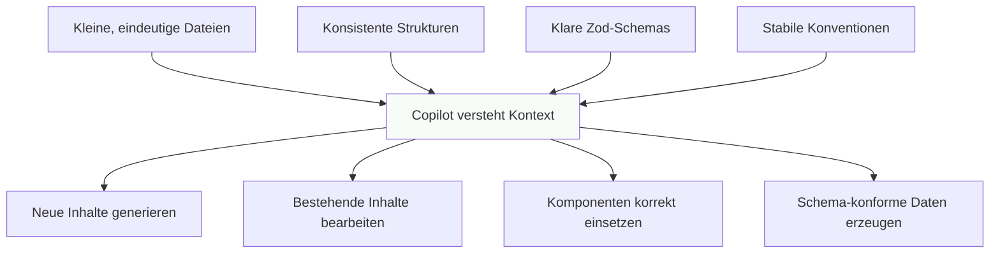

# Konzept: DEMOCRACY Deutschland Website — Content as Code

## 1. Ausgangslage

Die bestehende Website von DEMOCRACY Deutschland e.V. ist eine PHP-basierte Single-Page-Application mit:

- **21 Seiten** (Home, Wahlometer, Über uns, Spenden, FAQ, Presse, etc.)
- Custom MVC-Framework mit `.tpl`-Template-System
- MySQL-Datenbank für FAQ, Roadmap, Spenden-Daten, Medien
- Eingebetteter WordPress-Blog
- Bootstrap 4 + jQuery Frontend
- SAI (Admin-Backend) für Content-Verwaltung
- Hash-basiertes Routing (`#!page`)

### Probleme des aktuellen Systems

| Problem                     | Auswirkung                             |
| --------------------------- | -------------------------------------- |
| Custom PHP-Framework        | Schwer wartbar, kein Community-Support |
| WordPress-Abhängigkeit      | Sicherheits-Updates, Komplexität       |
| MySQL für statische Inhalte | Unnötiger Infrastruktur-Overhead       |
| SAI-Admin-Backend           | Proprietär, schlecht dokumentiert      |
| Hash-Routing                | Schlecht für SEO, kein SSR             |
| Bootstrap 4 + jQuery        | Veraltet, großes Bundle                |

---

## 2. Zielarchitektur

### Stack-Entscheidung

```
Next.js 15 + TypeScript + MDX + YAML + Zod + Tailwind CSS
```

### Prinzip: „Content as Code"



**Kernidee:** Alle Inhalte liegen als Dateien im Repository. Änderungen erfolgen per Pull Request. Beim Build wird alles validiert und als statische HTML-Seiten exportiert.

### Warum dieser Stack?

| Entscheidung          | Begründung                                                             |
| --------------------- | ---------------------------------------------------------------------- |
| **Next.js 15**        | App Router, Static Export, MDX-Support, großes Ecosystem               |
| **TypeScript**        | Typsicherheit für Schemas, Loader, Komponenten                         |
| **MDX**               | Markdown + React-Komponenten — ideal für redaktionelle Inhalte         |
| **YAML**              | Besser lesbar als JSON für strukturierte Daten (Navigation, FAQ, Team) |
| **Zod**               | TypeScript-first Validierung, Build-time Fehler statt Runtime-Fehler   |
| **Tailwind CSS**      | Utility-first, kein CSS-Overhead, hervorragend für Copilot             |
| **Statischer Export** | Kein Server nötig, schnell, günstig, sicher                            |

---

## 3. Content-Architektur

### Die drei Content-Typen



### Regel

| Inhalt                 | Format  | Beispiel                             |
| ---------------------- | ------- | ------------------------------------ |
| Fließtext mit Struktur | `.mdx`  | Über uns, Impressum, Datenschutz     |
| Datierte Beiträge      | `.mdx`  | Blogposts, Pressemitteilungen        |
| Listen & Konfiguration | `.yaml` | Navigation, FAQ, Team, Spenden-Daten |

---

## 4. Repo-Struktur

```
democracy-website/
├── content/                          # ← Alle Inhalte
│   ├── pages/                        #    Dokumentseiten
│   │   ├── home.mdx
│   │   ├── ueber-uns.mdx
│   │   ├── spenden.mdx
│   │   ├── wahlometer.mdx
│   │   ├── buerger.mdx
│   │   ├── politiker.mdx
│   │   ├── engineering.mdx
│   │   ├── kontakt.mdx
│   │   ├── impressum.mdx
│   │   ├── datenschutz.mdx
│   │   └── nutzungsbedingungen.mdx
│   ├── blog/                         #    Blog-Artikel
│   │   ├── 2026-04-10-beispiel.mdx
│   │   └── ...
│   ├── faq/                          #    FAQ-Einträge
│   │   └── allgemein.yaml
│   ├── team/                         #    Team-Daten
│   │   └── members.yaml
│   ├── press/                        #    Presse-Material
│   │   └── media.yaml
│   ├── roadmap/                      #    Engineering-Roadmap
│   │   └── goals.yaml
│   ├── donate/                       #    Spenden-Konfiguration
│   │   └── config.yaml
│   └── site/                         #    Globale Konfiguration
│       ├── navigation.yaml
│       ├── footer.yaml
│       └── seo.yaml
│
├── src/
│   ├── app/                          # ← Next.js App Router
│   │   ├── layout.tsx                #    Root-Layout
│   │   ├── page.tsx                  #    Startseite
│   │   ├── ueber-uns/page.tsx
│   │   ├── spenden/page.tsx
│   │   ├── wahlometer/page.tsx
│   │   ├── buerger/page.tsx
│   │   ├── politiker/page.tsx
│   │   ├── engineering/page.tsx
│   │   ├── faq/page.tsx
│   │   ├── presse/page.tsx
│   │   ├── blog/
│   │   │   ├── page.tsx              #    Blog-Übersicht
│   │   │   └── [slug]/page.tsx       #    Blog-Einzelseite
│   │   ├── kontakt/page.tsx
│   │   ├── impressum/page.tsx
│   │   ├── datenschutz/page.tsx
│   │   └── nutzungsbedingungen/page.tsx
│   │
│   ├── components/                   # ← React-Komponenten
│   │   ├── ui/                       #    Basis-UI (Button, Card, etc.)
│   │   ├── layout/                   #    Layout (Navbar, Footer, etc.)
│   │   ├── blocks/                   #    Content-Blocks (Hero, Callout, etc.)
│   │   └── mdx/                      #    MDX-spezifische Komponenten
│   │
│   ├── lib/                          # ← Utilities & Loader
│   │   ├── content/
│   │   │   ├── load-mdx.ts           #    MDX-Dateien laden & parsen
│   │   │   ├── load-yaml.ts          #    YAML-Dateien laden & parsen
│   │   │   └── queries.ts            #    Content-Abfragen
│   │   ├── schemas/
│   │   │   ├── page.ts               #    Zod-Schema für Seiten
│   │   │   ├── blog.ts               #    Zod-Schema für Blog
│   │   │   ├── faq.ts                #    Zod-Schema für FAQ
│   │   │   ├── team.ts               #    Zod-Schema für Team
│   │   │   ├── navigation.ts         #    Zod-Schema für Navigation
│   │   │   ├── donate.ts             #    Zod-Schema für Spenden
│   │   │   └── roadmap.ts            #    Zod-Schema für Roadmap
│   │   └── utils.ts
│   │
│   └── styles/
│       └── globals.css               #    Tailwind + Custom Styles
│
├── public/                           # ← Statische Assets
│   ├── images/
│   ├── videos/
│   ├── downloads/
│   ├── fonts/
│   └── icons/
│
├── tests/                            # ← Tests
│   ├── unit/
│   ├── integration/
│   └── e2e/
│
├── next.config.ts
├── tailwind.config.ts
├── tsconfig.json
├── package.json
└── README.md
```

---

## 5. Content-Beispiele

### 5.1 Dokumentseite (MDX)

**`content/pages/ueber-uns.mdx`**

```mdx
---
title: "Über uns"
slug: "/ueber-uns"
seo:
  title: "Über uns | DEMOCRACY Deutschland"
  description: "Wer wir sind und wofür wir stehen."
hero:
  headline: "Politische Teilhabe digital neu gedacht"
  subline: "Transparent, unabhängig, gemeinwohlorientiert."
---

## Unsere Mission

Wir wollen politische Mitbestimmung einfacher zugänglich machen.
DEMOCRACY ermöglicht es jedem, über die gleichen Themen abzustimmen
wie der Bundestag — transparent und unabhängig.

<Callout variant="info">
  DEMOCRACY ist ein gemeinnütziger Verein. Alle unsere Produkte sind Open Source und frei verfügbar.
</Callout>

## Das Team

<TeamGrid />

## Unsere Werte

<ValueCards />
```

### 5.2 Blog-Artikel (MDX)

**`content/blog/2026-04-10-neue-funktionen.mdx`**

```mdx
---
title: "Neue Funktionen im Frühjahr 2026"
slug: "neue-funktionen-fruehjahr-2026"
date: "2026-04-10"
author: "Marius Krüger"
excerpt: "Ein Überblick über die neuesten Verbesserungen."
image: "/images/blog/fruehjahr-2026.jpg"
tags:
  - release
  - features
seo:
  title: "Neue Funktionen | DEMOCRACY Blog"
  description: "Überblick über die neuesten Verbesserungen der DEMOCRACY App."
---

Wir haben im Frühjahr 2026 einige spannende Neuerungen eingeführt...

## Verbessertes Wahlometer

Das Wahlometer zeigt jetzt detailliertere Vergleiche...
```

### 5.3 FAQ-Daten (YAML)

**`content/faq/allgemein.yaml`**

```yaml
- question: "Was ist DEMOCRACY?"
  answer: "DEMOCRACY ist eine App, die es dir ermöglicht, über die gleichen Themen abzustimmen wie der Deutsche Bundestag."
  category: "allgemein"

- question: "Ist DEMOCRACY kostenlos?"
  answer: "Ja, DEMOCRACY ist komplett kostenlos und werbefrei."
  category: "allgemein"

- question: "Wie finanziert sich DEMOCRACY?"
  answer: "DEMOCRACY finanziert sich ausschließlich durch Spenden und ehrenamtliche Arbeit."
  category: "finanzen"
```

### 5.4 Spenden-Konfiguration (YAML)

**`content/donate/config.yaml`**

```yaml
headline: "Unterstütze DEMOCRACY"
subline: "Jeder Beitrag zählt für mehr demokratische Teilhabe."

bankAccount:
  holder: "DEMOCRACY Deutschland e.V."
  iban: "DE33 5003 1000 1049 7560 00"
  bic: "TRODDEF1"
  bank: "Triodos Bank"

# Fortschrittsbalken — einfach im Code aktualisierbar
progress:
  current: 2850
  goal: 5000
  unit: "€/Monat"
  patrons: 142

categories:
  - label: "Server & Infrastruktur"
    amount: 800
    icon: "server"
  - label: "Entwicklung"
    amount: 1200
    icon: "code"
  - label: "Verwaltung"
    amount: 500
    icon: "building"
  - label: "Kommunikation"
    amount: 350
    icon: "megaphone"

callToAction:
  paypal: "https://paypal.me/democracydeutschland"
  bankTransfer: true
  minAmount: 5
```

### 5.5 Navigation (YAML)

**`content/site/navigation.yaml`**

```yaml
main:
  - label: "Home"
    href: "/"
  - label: "Wahlometer"
    href: "/wahlometer"
  - label: "Über Uns"
    href: "/ueber-uns"
  - label: "Spenden"
    href: "/spenden"
  - label: "Presse"
    href: "/presse"
  - label: "FAQ"
    href: "/faq"
  - label: "Kontakt"
    href: "/kontakt"

legal:
  - label: "Impressum"
    href: "/impressum"
  - label: "Datenschutz"
    href: "/datenschutz"
  - label: "Nutzungsbedingungen"
    href: "/nutzungsbedingungen"

social:
  - label: "GitHub"
    href: "https://github.com/demokratie-live"
    icon: "github"
  - label: "Twitter"
    href: "https://twitter.com/democracy_de"
    icon: "twitter"
  - label: "Instagram"
    href: "https://instagram.com/democracy.deutschland"
    icon: "instagram"
```

### 5.6 Team-Daten (YAML)

**`content/team/members.yaml`**

```yaml
core:
  - name: "Marius Krüger"
    role: "Gründer, Organisation & Produkt"
    image: "/images/team/marius.png"
    links:
      email: "marius.krueger@democracy-deutschland.de"
      linkedin: "https://linkedin.com/in/..."

  - name: "Manuel Ruck"
    role: "Software-Entwickler"
    image: "/images/team/manuel.png"
    links:
      email: "manuel.ruck@democracy-deutschland.de"
      github: "https://github.com/manuelruck"

  - name: "Elisa Menne"
    role: "Verwaltung, Kommunikation & Buchhaltung"
    image: "/images/team/elisa.png"
    links:
      email: "elisa.menne@democracy-deutschland.de"

volunteers:
  - name: "Timo Sieg"
    role: "Redaktion, Newsletter & Blog"
  - name: "Jasper Bennink"
    role: "Redaktion, Blog"
  - name: "Robert Schäfer"
    role: "Entwickler, Bundestag-Datenschnittstelle"
```

---

## 6. Zod-Validierung

### Schema-Architektur



### Beispiel-Schema

```typescript
// lib/schemas/page.ts
import { z } from "zod";

export const seoSchema = z.object({
  title: z.string().min(1),
  description: z.string().min(1),
});

export const pageFrontmatterSchema = z.object({
  title: z.string().min(1),
  slug: z.string().startsWith("/"),
  seo: seoSchema,
  hero: z
    .object({
      headline: z.string().min(1),
      subline: z.string().optional(),
      image: z.string().optional(),
    })
    .optional(),
});

export type PageFrontmatter = z.infer<typeof pageFrontmatterSchema>;
```

```typescript
// lib/schemas/donate.ts
import { z } from "zod";

export const donateProgressSchema = z.object({
  current: z.number().min(0),
  goal: z.number().min(1),
  unit: z.string().default("€/Monat"),
  patrons: z.number().min(0).optional(),
});

export const donateCategorySchema = z.object({
  label: z.string().min(1),
  amount: z.number().min(0),
  icon: z.string().min(1),
});

export const donateConfigSchema = z.object({
  headline: z.string().min(1),
  subline: z.string().optional(),
  bankAccount: z.object({
    holder: z.string().min(1),
    iban: z.string().min(1),
    bic: z.string().min(1),
    bank: z.string().min(1),
  }),
  progress: donateProgressSchema,
  categories: z.array(donateCategorySchema),
  callToAction: z.object({
    paypal: z.string().url().optional(),
    bankTransfer: z.boolean().default(true),
    minAmount: z.number().min(1).default(5),
  }),
});

export type DonateConfig = z.infer<typeof donateConfigSchema>;
```

---

## 7. Content-Loading-Pipeline



### Beispiel-Loader

```typescript
// lib/content/load-mdx.ts
import fs from "fs/promises";
import path from "path";
import matter from "gray-matter";
import { z } from "zod";

const CONTENT_DIR = path.join(process.cwd(), "content");

export async function loadPage<T>(
  filePath: string,
  schema: z.ZodType<T>,
): Promise<{ frontmatter: T; content: string }> {
  const fullPath = path.join(CONTENT_DIR, filePath);
  const raw = await fs.readFile(fullPath, "utf-8");
  const { data, content } = matter(raw);
  const frontmatter = schema.parse(data); // Wirft Fehler bei ungültigen Daten
  return { frontmatter, content };
}
```

```typescript
// lib/content/load-yaml.ts
import fs from "fs/promises";
import path from "path";
import yaml from "yaml";
import { z } from "zod";

const CONTENT_DIR = path.join(process.cwd(), "content");

export async function loadYaml<T>(filePath: string, schema: z.ZodType<T>): Promise<T> {
  const fullPath = path.join(CONTENT_DIR, filePath);
  const raw = await fs.readFile(fullPath, "utf-8");
  const data = yaml.parse(raw);
  return schema.parse(data);
}
```

---

## 8. Seitenübersicht & Migration

### Mapping: Alt → Neu

| Alte Seite (PHP)        | Neue Route             | Content-Typ      | Quelle                                                         |
| ----------------------- | ---------------------- | ---------------- | -------------------------------------------------------------- |
| `#!home`                | `/`                    | MDX              | `content/pages/home.mdx`                                       |
| `#!wahlometer`          | `/wahlometer`          | MDX              | `content/pages/wahlometer.mdx`                                 |
| `#!about`               | `/ueber-uns`           | MDX + YAML       | `content/pages/ueber-uns.mdx` + `content/team/members.yaml`    |
| `#!citizen`             | `/buerger`             | MDX              | `content/pages/buerger.mdx`                                    |
| `#!politicians`         | `/politiker`           | MDX              | `content/pages/politiker.mdx`                                  |
| `#!engineering`         | `/engineering`         | MDX + YAML       | `content/pages/engineering.mdx` + `content/roadmap/goals.yaml` |
| `#!donate`              | `/spenden`             | MDX + YAML       | `content/pages/spenden.mdx` + `content/donate/config.yaml`     |
| `#!faq`                 | `/faq`                 | YAML             | `content/faq/allgemein.yaml`                                   |
| `#!press`               | `/presse`              | MDX + YAML       | `content/pages/presse.mdx` + `content/press/media.yaml`        |
| `#!blog`                | `/blog`                | MDX (je Artikel) | `content/blog/*.mdx`                                           |
| `#!contact`             | `/kontakt`             | MDX              | `content/pages/kontakt.mdx`                                    |
| `#!datenschutz`         | `/datenschutz`         | MDX              | `content/pages/datenschutz.mdx`                                |
| `#!nutzungsbedingungen` | `/nutzungsbedingungen` | MDX              | `content/pages/nutzungsbedingungen.mdx`                        |
| `#!impressum`           | `/impressum`           | MDX              | `content/pages/impressum.mdx`                                  |
| WordPress `/blog/`      | `/blog/[slug]`         | MDX              | `content/blog/*.mdx`                                           |

### Entfallende Seiten

| Alte Seite             | Grund                                     |
| ---------------------- | ----------------------------------------- |
| `#!unsubscribe`        | Kein eigenes Newsletter-System mehr       |
| `#!invite`             | Beta-Phase abgeschlossen                  |
| SAI-Admin (`/sai.php`) | Entfällt — Content wird via Git verwaltet |
| `/api.php`             | Entfällt — kein Backend                   |

---

## 9. Kontaktformular (Statisch)

Da die Seite als statischer Export deployed wird, nutzen wir einen externen Formular-Service:



---

## 10. Deployment & CI/CD

### Build- und Deploy-Pipeline



### CI-Schritte im Detail

1. **Lint**: `eslint`, `tsc --noEmit`
2. **Content-Validierung**: Alle YAML/MDX-Frontmatter gegen Zod-Schemas prüfen
3. **Build**: `next build` (erzeugt `/out/` mit statischem HTML)
4. **Preview**: Automatische Preview-URL für jeden PR
5. **Deploy**: Auf Merge in `main` → automatisch live

### Redirects für alte URLs

```
/#!home        → /
/#!about       → /ueber-uns
/#!donate      → /spenden
/#!faq         → /faq
/#!press       → /presse
/#!contact     → /kontakt
/blog/slug     → /blog/slug
```

→ Client-seitiges Redirect-Script für Hash-basierte alte URLs.

---

## 11. MDX-Komponenten-System

### Verfügbare Content-Blocks

| Komponente          | Zweck                            | Beispiel             |
| ------------------- | -------------------------------- | -------------------- |
| `<Hero>`            | Seitenheader mit Headline + Bild | Startseite, Über uns |
| `<Callout>`         | Hervorgehobener Hinweis-Block    | Info, Warnung, Tipp  |
| `<TeamGrid>`        | Team-Mitglieder-Raster           | Über uns             |
| `<FAQAccordion>`    | Aufklappbare FAQ-Liste           | FAQ-Seite            |
| `<DonateBox>`       | Spendenfortschritt + CTA         | Spendenseite         |
| `<ProgressBar>`     | Visueller Fortschrittsbalken     | Spenden, Roadmap     |
| `<MediaGrid>`       | Presse-/Download-Raster          | Pressseite           |
| `<BlogList>`        | Blog-Artikel-Übersicht           | Blog-Index           |
| `<ContactForm>`     | Kontaktformular (extern)         | Kontaktseite         |
| `<AppBadges>`       | App Store / Play Store Buttons   | Startseite           |
| `<VideoPlayer>`     | Eingebetteter Video-Player       | Startseite           |
| `<RoadmapTimeline>` | Phasen-Ansicht der Roadmap       | Engineering          |
| `<ValueCards>`      | Werte-/Prinzipien-Karten         | Über uns             |

---

## 12. Copilot-Optimierung

### Warum dieser Aufbau ideal für Copilot ist



**Konventionen für Copilot:**

1. **Eine Datei pro Seite** — kein magisches Routing
2. **Frontmatter-Felder immer gleich** — Schema als Referenz
3. **Komponenten-Namen beschreibend** — `<DonateBox>` statt `<Box type="donate">`
4. **YAML für Daten, MDX für Text** — klare Trennung
5. **Zod-Schemas als Single Source of Truth** — Copilot liest die Schemas

---

## 13. Zusammenfassung

### Was wir gewinnen

| Vorher (PHP)               | Nachher (Next.js + MDX) |
| -------------------------- | ----------------------- |
| MySQL-Datenbank nötig      | Keine Datenbank         |
| WordPress für Blog         | MDX-Dateien im Repo     |
| Admin-Backend (SAI)        | Git + Pull Requests     |
| Server mit PHP/Apache      | Statischer Export (CDN) |
| Hash-Routing, kein SEO     | Saubere URLs, SSG       |
| Bootstrap 4 + jQuery       | Tailwind CSS            |
| Custom Template-Engine     | React-Komponenten       |
| Keine Validierung          | Zod Build-time Checks   |
| Deployment: Docker + MySQL | Deployment: `git push`  |

### Was wir bewusst weglassen

- ❌ Visuelles Admin-Backend
- ❌ Datenbank
- ❌ Server-seitige API
- ❌ Newsletter-System (extern lösen wenn nötig)
- ❌ Beta-Invite-System (nicht mehr relevant)
- ❌ SAI-Module (Content wird im Code verwaltet)
