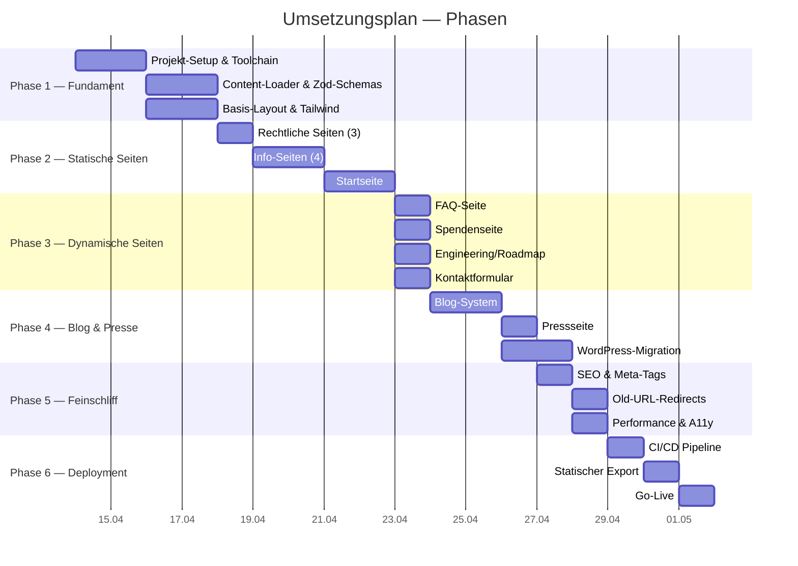
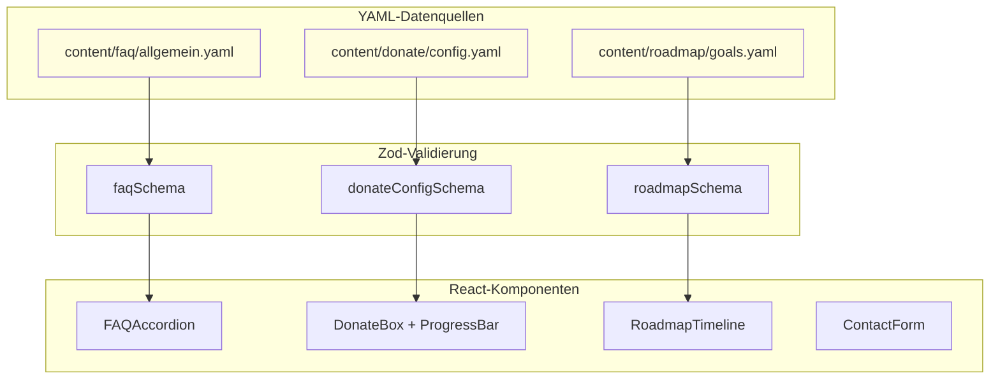
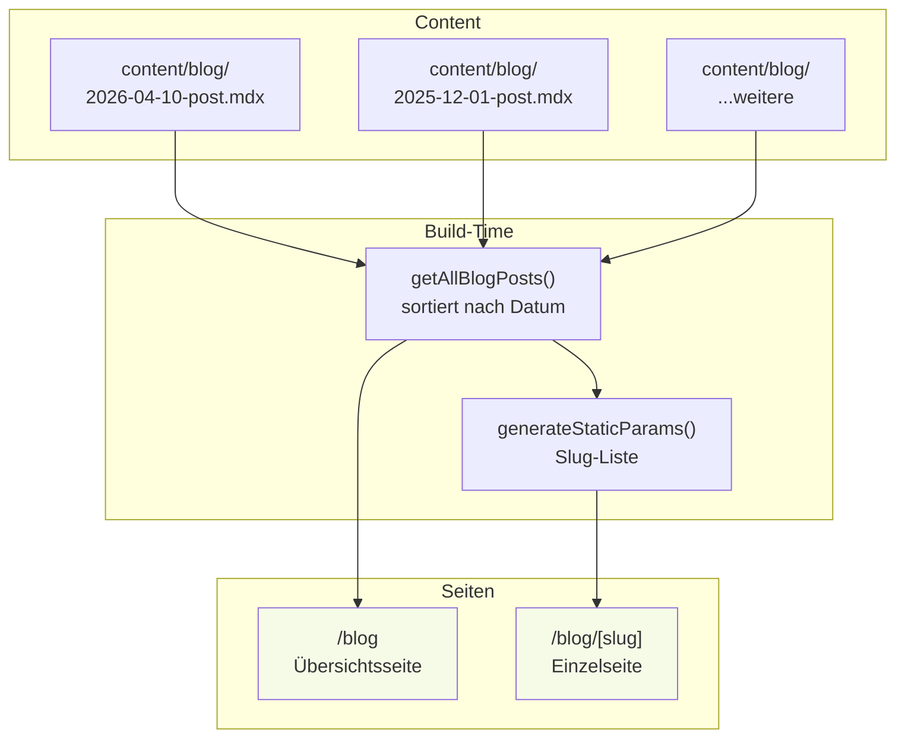
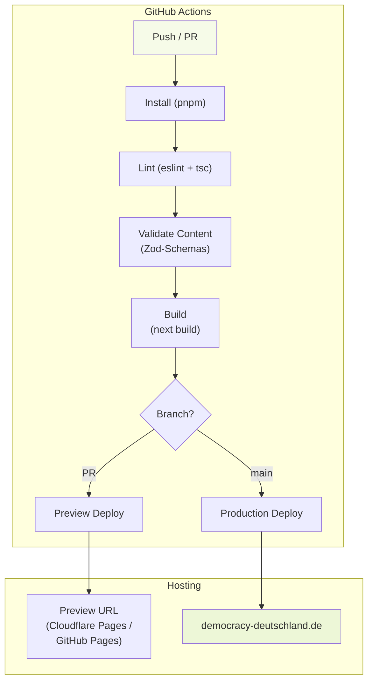
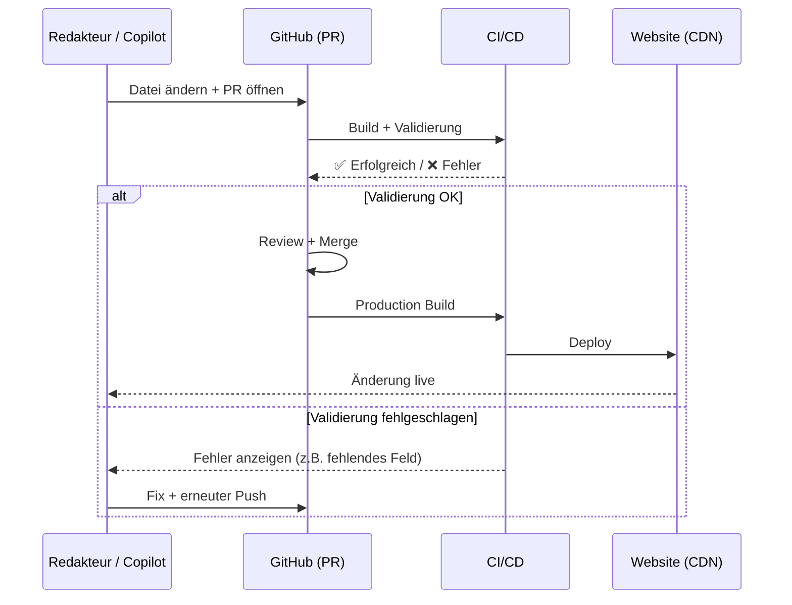
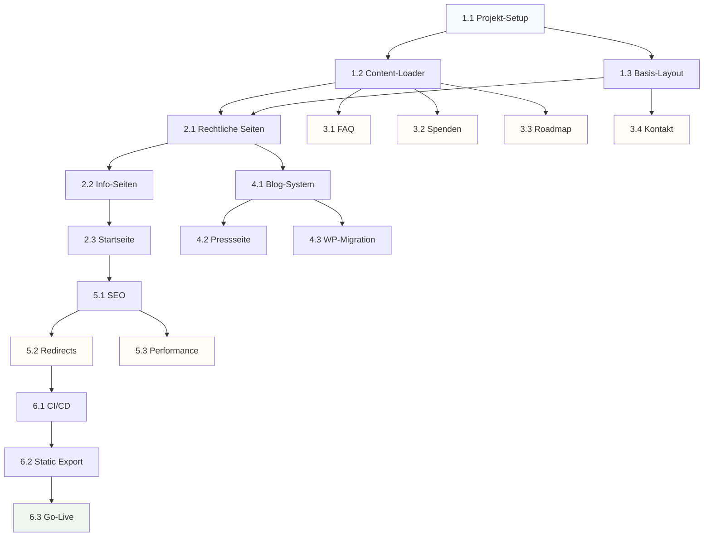

# Umsetzungsplan: DEMOCRACY Website — Content as Code

## Übersicht

Dieser Plan beschreibt die schrittweise Umsetzung der neuen DEMOCRACY-Website
auf Basis von Next.js + TypeScript + MDX + YAML + Zod mit statischem Export.

beachte [./konzept.md](./konzept.md) für die zugrundeliegenden Design- und Architekturentscheidungen.

### Gesamtablauf



---

## Phase 1 — Fundament

### 1.1 Projekt-Setup & Toolchain

**Ziel:** Lauffähiges Next.js-Projekt mit allen nötigen Tools.

**Schritte:**

1. Neues Next.js 15 Projekt erstellen (App Router, TypeScript, Tailwind CSS)
2. Verzeichnisstruktur anlegen:
   ```
   content/
     pages/
     blog/
     faq/
     team/
     press/
     roadmap/
     donate/
     site/
   src/
     app/
     components/
     lib/
       content/
       schemas/
     styles/
   public/
   tests/
   ```
3. Dependencies installieren (aktuelle versionen mindestens 3 tage alt):
   - `next`, `react`, `react-dom`
   - `typescript`, `@types/react`, `@types/node`
   - `tailwindcss`, `@tailwindcss/typography`
   - `zod`
   - `gray-matter` (Frontmatter-Parser)
   - `yaml` (YAML-Parser)
   - `next-mdx-remote` (MDX-Rendering)
   - `lucide-react` (Icons, ersetzt Font Awesome)
4. `next.config.ts` konfigurieren:
   - `output: 'export'` (statischer Export)
   - Bild-Optimierung für statischen Export
5. ESLint + Prettier + knip.dev konfigurieren
6. `.gitignore` aktualisieren

**Ergebnis:** `pnpm dev` startet, leere Seite rendert.

---

### 1.2 Content-Loader & Zod-Schemas

**Ziel:** Typsicheres Laden von MDX- und YAML-Dateien.

**Schritte:**

1. **Zod-Schemas definieren** (`src/lib/schemas/`):

   ```
   src/lib/schemas/
   ├── seo.ts          # SEO-Metadaten (title, description)
   ├── page.ts         # Seiten-Frontmatter (title, slug, seo, hero)
   ├── blog.ts         # Blog-Frontmatter (title, date, author, tags, excerpt)
   ├── faq.ts          # FAQ-Einträge (question, answer, category)
   ├── team.ts         # Team-Mitglieder (name, role, image, links)
   ├── navigation.ts   # Navigation (label, href, icon?)
   ├── donate.ts       # Spenden-Config (progress, categories, bankAccount)
   ├── roadmap.ts      # Roadmap-Ziele (title, phase, status, github?)
   ├── press.ts        # Presse/Media (title, type, url, date)
   └── index.ts        # Re-export aller Schemas
   ```

2. **Content-Loader implementieren** (`src/lib/content/`):

   ```
   src/lib/content/
   ├── load-mdx.ts     # MDX-Dateien lesen, Frontmatter extrahieren, validieren
   ├── load-yaml.ts    # YAML-Dateien lesen, parsen, validieren
   ├── queries.ts      # Abfrage-Funktionen (getAllBlogPosts, getPage, etc.)
   └── index.ts        # Re-exports
   ```

3. **Validierungs-Script** für CI:
   ```
   scripts/validate-content.ts
   ```
   → Prüft alle Content-Dateien gegen ihre Schemas.

**Ergebnis:** `loadPage("pages/test.mdx", pageSchema)` gibt typsichere Daten zurück. Ungültige Dateien werfen Build-Fehler.

---

### 1.3 Basis-Layout & Tailwind

**Ziel:** Grundlayout mit Navbar, Footer und Tailwind-Styling.

**Schritte:**

1. **Root-Layout** (`src/app/layout.tsx`):
   - HTML-Grundstruktur (lang="de")
   - Meta-Tags (Favicon, Manifest, OG-Defaults)
   - Navbar + Footer
   - Custom Fonts laden (Inter oder ähnlich)

2. **Navbar-Komponente** (`src/components/layout/Navbar.tsx`):
   - Navigation aus `content/site/navigation.yaml` laden
   - Responsive Mobile-Menü
   - Logo + Hauptnavigation + CTA-Button (Spenden)

3. **Footer-Komponente** (`src/components/layout/Footer.tsx`):
   - Footer aus `content/site/footer.yaml` laden
   - Links, Social Icons, Copyright

4. **Tailwind konfigurieren**:
   - Custom Colors (DEMOCRACY-Brandfarben)
   - Typography-Plugin für MDX-Prosa
   - Responsive Breakpoints

5. **Content-Dateien anlegen**:
   ```yaml
   # content/site/navigation.yaml
   # content/site/footer.yaml
   # content/site/seo.yaml
   ```

**Ergebnis:** Jede Seite hat automatisch Navbar + Footer. Navigation kommt aus YAML.

---

## Phase 2 — Statische Seiten

### 2.1 Rechtliche Seiten

**Ziel:** Die drei juristisch notwendigen Seiten migrieren.

**Seiten:**

| Seite               | Route                  | Content-Quelle                          |
| ------------------- | ---------------------- | --------------------------------------- |
| Impressum           | `/impressum`           | `content/pages/impressum.mdx`           |
| Datenschutz         | `/datenschutz`         | `content/pages/datenschutz.mdx`         |
| Nutzungsbedingungen | `/nutzungsbedingungen` | `content/pages/nutzungsbedingungen.mdx` |

**Schritte:**

1. MDX-Komponenten-Provider einrichten (`src/components/mdx/MDXComponents.tsx`)
2. Generische Seitenkomponente erstellen, die MDX-Inhalt rendert
3. Bestehende Inhalte aus PHP-Templates in MDX-Dateien übertragen
4. Seiten-Routen im App Router anlegen

**Ergebnis:** Drei vollständige rechtliche Seiten mit korrektem Inhalt.

---

### 2.2 Info-Seiten

**Ziel:** Informationsseiten migrieren.

**Seiten:**

| Seite      | Route         | Besonderheiten                    |
| ---------- | ------------- | --------------------------------- |
| Über uns   | `/ueber-uns`  | TeamGrid-Komponente, ValueCards   |
| Bürger     | `/buerger`    | Reine MDX-Seite                   |
| Politiker  | `/politiker`  | Reine MDX-Seite                   |
| Wahlometer | `/wahlometer` | App-Screenshots, Video-Einbettung |

**Schritte:**

1. **Team-Daten** erstellen (`content/team/members.yaml`)
2. **TeamGrid-Komponente** bauen (liest Team aus YAML)
3. **ValueCards-Komponente** bauen (6 Werte-Karten)
4. **AppBadges-Komponente** (App Store + Play Store Links)
5. **VideoPlayer-Komponente** (für Tutorial-Videos)
6. MDX-Inhalte aus PHP-Templates übertragen
7. Seiten-Routen anlegen

**Ergebnis:** Alle Info-Seiten mit korrektem Inhalt und interaktiven Komponenten.

---

### 2.3 Startseite

**Ziel:** Landing Page migrieren.

**Schritte:**

1. **Hero-Komponente** mit Headline, Subline, CTA
2. **App-Download-Section** mit Badges
3. **Feature-Sections** (Wahlometer, Abstimmungen, Vergleich)
4. **Video-Section** mit Tutorial-Videos
5. **Call-to-Action-Section** (Spenden, Mitmachen)
6. Content aus `content/pages/home.mdx`

**Ergebnis:** Vollständige Startseite mit allen Sektionen.

---

## Phase 3 — Dynamische Seiten

### Übersicht der Komponenten



---

### 3.1 FAQ-Seite

**Schritte:**

1. FAQ-Daten in `content/faq/allgemein.yaml` übertragen (aus DB/SAI)
2. `FAQAccordion`-Komponente bauen (Aufklapp-Verhalten, Kategorien)
3. Seite `/faq` anlegen — lädt YAML, rendert Accordion
4. Optional: Kategorie-Filter

---

### 3.2 Spendenseite

**Schritte:**

1. Spenden-Config in `content/donate/config.yaml`
   - Fortschrittsbalken-Werte (`progress.current`, `progress.goal`)
   - Bankverbindung
   - Kategorien (Server, Entwicklung, etc.)
   - PayPal-Link
2. Komponenten bauen:
   - `DonateBox` (Fortschrittsbalken + Zahlen)
   - `DonateCategories` (Aufschlüsselung)
   - `BankTransferInfo` (IBAN, BIC)
3. Seite `/spenden` anlegen

**Update-Workflow für Fortschrittsbalken:**

```yaml
# Einfach in content/donate/config.yaml ändern:
progress:
  current: 3200 # ← Wert aktualisieren
  goal: 5000
```

→ PR öffnen → Merge → automatisch deployed.

---

### 3.3 Engineering/Roadmap

**Schritte:**

1. Roadmap-Daten in `content/roadmap/goals.yaml` übertragen
2. `RoadmapTimeline`-Komponente bauen:
   - 3 Phasen: Beta, MVP, Dream
   - Status-Icons (erledigt, in Arbeit, geplant)
   - Optional: GitHub-Issue-Links
3. Seite `/engineering` anlegen

---

### 3.4 Kontaktformular

**Schritte:**

1. Externen Formular-Service einrichten (Formspree oder Web3Forms)
2. `ContactForm`-Komponente bauen:
   - Felder: Vorname, Nachname, E-Mail, Nachricht
   - Client-seitige Validierung (Zod)
   - Absende-Logik (fetch an externen Service)
   - Erfolgs-/Fehler-Meldung
3. Seite `/kontakt` anlegen

---

## Phase 4 — Blog & Presse

### 4.1 Blog-System

**Architektur:**



**Schritte:**

1. Blog-Abfragefunktionen implementieren:
   - `getAllBlogPosts()` — alle Artikel sortiert nach Datum
   - `getBlogPost(slug)` — einzelnen Artikel laden
   - `getBlogPostsByTag(tag)` — nach Tag filtern
2. Blog-Index (`/blog/page.tsx`):
   - Artikelliste mit Titel, Datum, Excerpt, Bild
   - Pagination (statisch generiert)
3. Blog-Einzelseite (`/blog/[slug]/page.tsx`):
   - `generateStaticParams()` für alle Slugs
   - MDX-Rendering mit Komponenteen
4. Blog-Listing-Komponente (`BlogCard`, `BlogList`)

---

### 4.2 Pressseite

**Schritte:**

1. Presse-Daten in `content/press/media.yaml`:
   - Kategorien: Presse, Publikationen, Downloads
   - Je Eintrag: Titel, Link, Datum, Typ, Bild
2. `MediaGrid`-Komponente mit Kategorie-Tabs
3. Blog-Teaser auf Pressseite (letzte 3 Artikel)
4. Seite `/presse` anlegen

---

### 4.3 WordPress-Migration

**Schritte:**

1. Bestehende WordPress-Posts exportieren (WP-Export oder SQL)
2. Posts in MDX-Dateien konvertieren:
   - Frontmatter generieren (title, date, author, tags)
   - HTML → Markdown konvertieren
   - Bilder in `/public/images/blog/` kopieren
3. Script schreiben: `scripts/migrate-wordpress.ts`
4. Qualitätsprüfung der migrierten Artikel

---

## Phase 5 — Feinschliff

### 5.1 SEO & Meta-Tags

**Schritte:**

1. Globale SEO-Defaults aus `content/site/seo.yaml`
2. Per-Page SEO aus MDX-Frontmatter
3. `generateMetadata()` in jeder Seite
4. Open Graph Tags (og:title, og:description, og:image)
5. `sitemap.xml` generieren (via `next-sitemap` oder manuell)
6. `robots.txt` erstellen

---

### 5.2 Old-URL-Redirects

**Ziel:** Alte Hash-URLs auf neue Pfade umleiten.

**Schritte:**

1. Client-seitiges Redirect-Script für `/#!page`-URLs:
   ```typescript
   // src/app/layout.tsx oder separates Script
   if (window.location.hash.startsWith("#!")) {
     const page = window.location.hash.replace("#!", "");
     const redirectMap = {
       home: "/",
       about: "/ueber-uns",
       donate: "/spenden",
       // ...
     };
     if (redirectMap[page]) {
       window.location.replace(redirectMap[page]);
     }
   }
   ```
2. 404-Seite mit hilfreichen Links
3. WordPress-URL-Redirects (`/blog/year/month/slug` → `/blog/slug`)

---

### 5.3 Performance & Accessibility

**Schritte:**

1. Bilder optimieren (WebP-Format, responsive Größen)
2. Fonts optimieren (Subset, `font-display: swap`)
3. Lighthouse-Audit (Ziel: 95+ in allen Kategorien)
4. A11y-Prüfung:
   - Korrekte Überschriften-Hierarchie
   - Alt-Texte für alle Bilder
   - Tastatur-Navigation
   - Farbkontrast
5. Skip-to-content Link
6. ARIA-Labels wo nötig

---

## Phase 6 — Deployment

### 6.1 CI/CD Pipeline



**Schritte:**

1. GitHub Actions Workflow erstellen:
   ```yaml
   # .github/workflows/deploy.yml
   - pnpm install
   - pnpm lint
   - pnpm validate-content
   - pnpm build
   - Deploy to GitHub Pages / Cloudflare Pages
   ```
2. Branch-Protection: PR muss CI bestehen
3. Preview-Deployments für PRs

---

### 6.2 Statischer Export konfigurieren

**Schritte:**

1. `next.config.ts` — `output: 'export'`
2. Bilder: `unoptimized: true` (kein Image-Server)
3. Build testen: `pnpm build` → `/out/` Verzeichnis
4. Lokaler Test: `npx serve out/`

---

### 6.3 Go-Live

**Schritte:**

1. DNS konfigurieren (democracy-deutschland.de → Hosting)
2. SSL-Zertifikat (automatisch bei Cloudflare/GitHub Pages)
3. Finale Prüfung:
   - Alle Seiten erreichbar
   - Alle Redirects funktionieren
   - Kontaktformular funktioniert
   - SEO-Tags korrekt
   - Mobile-Ansicht korrekt
4. Altes PHP-System deaktivieren

---

## Redaktions-Workflow (nach Go-Live)

### Content ändern



### Typische Aufgaben

| Aufgabe                    | Was tun         | Datei                                            |
| -------------------------- | --------------- | ------------------------------------------------ |
| FAQ hinzufügen             | Eintrag in YAML | `content/faq/allgemein.yaml`                     |
| Blogpost schreiben         | Neue MDX-Datei  | `content/blog/2026-xx-xx-titel.mdx`              |
| Team-Mitglied ändern       | YAML bearbeiten | `content/team/members.yaml`                      |
| Spendenstand aktualisieren | YAML bearbeiten | `content/donate/config.yaml`                     |
| Navigation ändern          | YAML bearbeiten | `content/site/navigation.yaml`                   |
| Seite inhaltlich ändern    | MDX bearbeiten  | `content/pages/seitenname.mdx`                   |
| Neue Seite erstellen       | MDX + Route     | `content/pages/neu.mdx` + `src/app/neu/page.tsx` |

---

## Datei-Checkliste

### Content-Dateien (zu erstellen)

- [ ] `content/pages/home.mdx`
- [ ] `content/pages/ueber-uns.mdx`
- [ ] `content/pages/wahlometer.mdx`
- [ ] `content/pages/buerger.mdx`
- [ ] `content/pages/politiker.mdx`
- [ ] `content/pages/engineering.mdx`
- [ ] `content/pages/spenden.mdx`
- [ ] `content/pages/kontakt.mdx`
- [ ] `content/pages/impressum.mdx`
- [ ] `content/pages/datenschutz.mdx`
- [ ] `content/pages/nutzungsbedingungen.mdx`
- [ ] `content/faq/allgemein.yaml`
- [ ] `content/team/members.yaml`
- [ ] `content/donate/config.yaml`
- [ ] `content/roadmap/goals.yaml`
- [ ] `content/press/media.yaml`
- [ ] `content/site/navigation.yaml`
- [ ] `content/site/footer.yaml`
- [ ] `content/site/seo.yaml`
- [ ] `content/blog/*.mdx` (WordPress-Migration)

### Zod-Schemas (zu implementieren)

- [ ] `src/lib/schemas/seo.ts`
- [ ] `src/lib/schemas/page.ts`
- [ ] `src/lib/schemas/blog.ts`
- [ ] `src/lib/schemas/faq.ts`
- [ ] `src/lib/schemas/team.ts`
- [ ] `src/lib/schemas/navigation.ts`
- [ ] `src/lib/schemas/donate.ts`
- [ ] `src/lib/schemas/roadmap.ts`
- [ ] `src/lib/schemas/press.ts`

### Komponenten (zu implementieren)

- [ ] `src/components/layout/Navbar.tsx`
- [ ] `src/components/layout/Footer.tsx`
- [ ] `src/components/blocks/Hero.tsx`
- [ ] `src/components/blocks/Callout.tsx`
- [ ] `src/components/blocks/TeamGrid.tsx`
- [ ] `src/components/blocks/FAQAccordion.tsx`
- [ ] `src/components/blocks/DonateBox.tsx`
- [ ] `src/components/blocks/ProgressBar.tsx`
- [ ] `src/components/blocks/MediaGrid.tsx`
- [ ] `src/components/blocks/BlogList.tsx`
- [ ] `src/components/blocks/BlogCard.tsx`
- [ ] `src/components/blocks/ContactForm.tsx`
- [ ] `src/components/blocks/AppBadges.tsx`
- [ ] `src/components/blocks/VideoPlayer.tsx`
- [ ] `src/components/blocks/RoadmapTimeline.tsx`
- [ ] `src/components/blocks/ValueCards.tsx`
- [ ] `src/components/blocks/BankTransferInfo.tsx`
- [ ] `src/components/mdx/MDXComponents.tsx`

### Seiten (App Router)

- [ ] `src/app/layout.tsx`
- [ ] `src/app/page.tsx` (Home)
- [ ] `src/app/ueber-uns/page.tsx`
- [ ] `src/app/wahlometer/page.tsx`
- [ ] `src/app/buerger/page.tsx`
- [ ] `src/app/politiker/page.tsx`
- [ ] `src/app/engineering/page.tsx`
- [ ] `src/app/spenden/page.tsx`
- [ ] `src/app/faq/page.tsx`
- [ ] `src/app/presse/page.tsx`
- [ ] `src/app/blog/page.tsx`
- [ ] `src/app/blog/[slug]/page.tsx`
- [ ] `src/app/kontakt/page.tsx`
- [ ] `src/app/impressum/page.tsx`
- [ ] `src/app/datenschutz/page.tsx`
- [ ] `src/app/nutzungsbedingungen/page.tsx`
- [ ] `src/app/not-found.tsx`

### Infrastruktur

- [ ] `next.config.ts`
- [ ] `tailwind.config.ts`
- [ ] `tsconfig.json`
- [ ] `package.json`
- [ ] `.eslintrc.json`
- [ ] `.prettierrc`
- [ ] `.github/workflows/deploy.yml`
- [ ] `scripts/validate-content.ts`
- [ ] `scripts/migrate-wordpress.ts`

---

## Abhängigkeiten zwischen Phasen



**Parallele Arbeit möglich:**

- Phase 3 (FAQ, Spenden, Roadmap, Kontakt) kann parallel nach Phase 1 starten
- Phase 5.2 und 5.3 können parallel laufen
- WordPress-Migration (4.3) kann unabhängig vom Blog-System vorbereitet werden

---

## Technische Entscheidungen (Zusammenfassung)

| Entscheidung    | Wahl                            | Alternative              | Begründung                                    |
| --------------- | ------------------------------- | ------------------------ | --------------------------------------------- |
| Framework       | Next.js 15                      | Astro, Gatsby            | App Router, MDX-Support, großes Ecosystem     |
| Sprache         | TypeScript                      | JavaScript               | Typsicherheit, bessere DX, Zod-Integration    |
| Content-Format  | MDX + YAML                      | Nur MDX, Nur JSON        | Optimal: MDX für Text, YAML für Daten         |
| Validierung     | Zod                             | Yup, Joi                 | TypeScript-first, Build-time Fehler           |
| CSS             | Tailwind CSS                    | Bootstrap 5, CSS Modules | Modern, kein CSS-Overhead, Copilot-freundlich |
| Icons           | Lucide React                    | Font Awesome             | Treeshakable, SVG, kein Font-Laden            |
| Deployment      | Static Export                   | SSR, ISR                 | Kein Server nötig, schnell, günstig           |
| Hosting         | GitHub Pages / Cloudflare Pages | Vercel, Netlify          | Kostenlos, einfach, Git-Integration           |
| Formular        | Formspree / Web3Forms           | Eigener Server           | Statisch kompatibel, kein Backend nötig       |
| Package Manager | pnpm                            | npm, yarn                | Schneller, strenger, Workspace-Support        |
